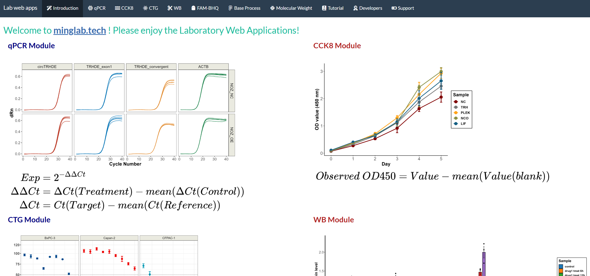

# Lab web apps

### Description

A shiny web app to help process the data of some wet-lab experiments.

### Overview



### Deploy on your laptop

```shell
1. Download and install R, Rstudio, and corresponding dependencies;
2. Download this project;
3. Open this project via Rstudio (if there is no .Rproj file, you can create project through `Existing Directory`);
4. Open the `app.R` file;
5. Click the `Run App` button at the Rstudio interface;
6. Enjoy yourself. ヾ(ｏ･ω･)ﾉ
```

### Dependencies

```R
shiny, shinythemes, readxl, ggplot2, stringr, DT, drc, patchwork, RColorBrewer,
ComplexHeatmap, circlize, ggplotify, dplyr, ggsci, reshape2
```

```R
# install the depencencies
packages <- c("shiny", "shinythemes", "readxl", "ggplot2", "stringr", "DT", "drc", "patchwork", "RColorBrewer",
                "ComplexHeatmap", "circlize", "ggplotify", "dplyr", "ggsci", "reshape2")
for (pkg in packages){
    if(!requireNamespace(pkg, quietly = TRUE))
    install.packages(pkg)
}
```
